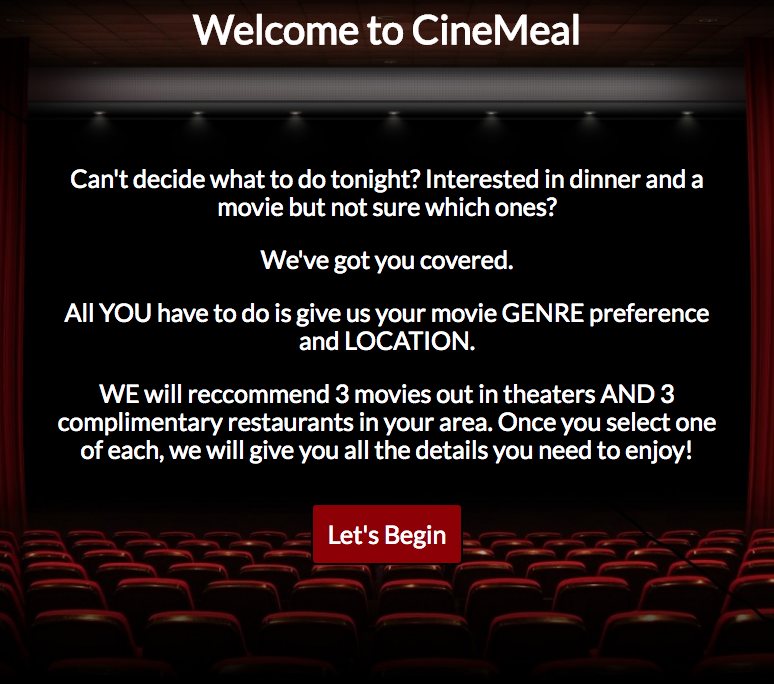
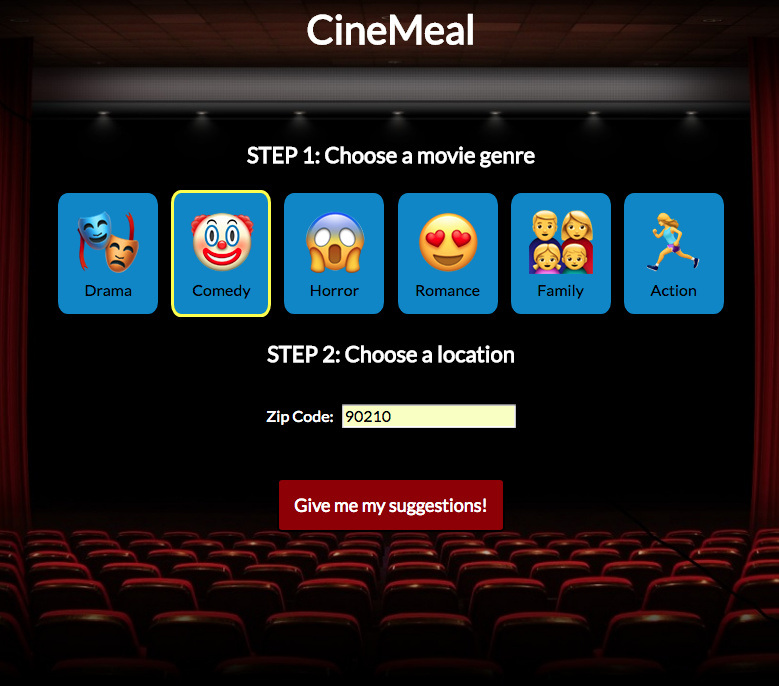
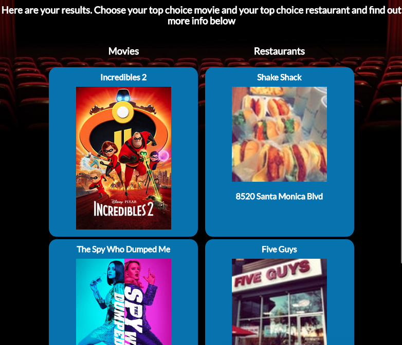
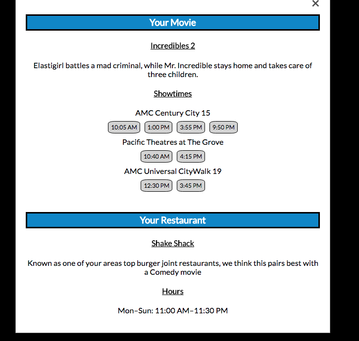

# CineMeal

## Live App
- [Live Demo](https://asiede.github.io/CineMeal/)

## What it does
A tool that suggests several recommendations for movies currently out in theaters along with a complimentary restaurant. Recommendations are based on the user's movie genre preference and location input. After a user selects their top choice of a movie and a restaurant, additional information is given in order to provide the perfect Dinner and Movie outing.

## What it looks like
Landing Page:

User preference selection:

Results:

More info section:

## How it is built
### Front End
* HTML
* CSS
* JavaScript
* jQuery
### APIs used
* Foursquare
* The Movie Database
* Gracenote

